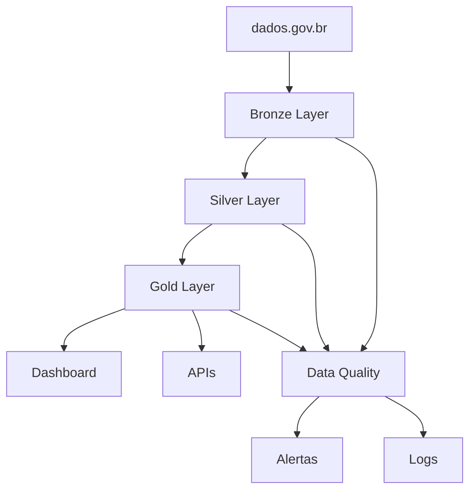

# 🏗️ Documentação de Arquitetura

## Visão Geral

O projeto implementa uma arquitetura medalhão (Medallion Architecture) para processamento de dados de combustíveis, seguindo as melhores práticas de engenharia de dados moderna.

## Princípios Arquiteturais

### 1. Separação por Camadas

- **Bronze**: Dados brutos sem processamento
- **Silver**: Dados limpos e normalizados
- **Gold**: Dados agregados para consumo

### 2. Idempotência

- Cada job pode ser executado múltiplas vezes com o mesmo resultado
- Particionamento permite reprocessamento incremental

### 3. Qualidade de Dados

- Validação automática em cada camada
- Métricas de qualidade calculadas e armazenadas
- Alertas para anomalias de dados

### 4. Escalabilidade

- Particionamento otimizado para performance
- Arquitetura preparada para Apache Spark
- Suporte a processamento distribuído

## Fluxo de Dados

## Decisões Técnicas

### Formato de Dados

- **Parquet**: Escolhido para performance e compressão
- **Particionamento**: Por ano, região e produto para otimizar consultas
- **Compressão**: Snappy para equilíbrio performance/espaço

### Processamento

- **pandas**: Para processamento em memória (datasets médios)
- **Preparação Spark**: Código estruturado para migração futura
- **Validação**: Great Expectations para qualidade de dados

### Interface

- **Streamlit**: Prototipagem rápida de dashboard
- **Plotly**: Visualizações interativas
- **Jupyter**: Análise exploratória e documentação

## Padrões de Código

### Estrutura de Jobs

- Cada camada implementa padrão de Job com interface comum
- Logging estruturado para rastreabilidade
- Tratamento de erros robusto

### Configuração

- Configurações centralizadas em dataclasses
- Environment variables para secrets
- Configuração por ambiente (dev/prod)

### Testes

- Testes unitários para transformações
- Testes de integração para fluxo completo
- Validação de qualidade automatizada
